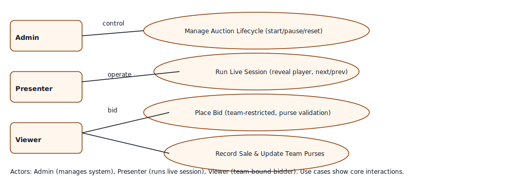

# 🏏 IPL Auction Portal

A professional, real-time cricket player auction portal with role-based access control and WebSocket synchronization. This project provides an authentic auction experience with three role types (Admin, Presenter, Viewer), real-time synchronization via Socket.IO, and persistent audit logs for all events.

## Architecture Diagram

The high-level architecture shows browser clients (Admin, Presenter, Viewer) communicating with the React frontend, which uses Socket.IO and REST endpoints to interact with the Node/Express backend. The backend persists data to a relational database (Postgres in production, SQLite for development) and can use Redis as a Socket.IO adapter for scaling. Monitoring and logging are included for production readiness.


## Use Case Diagram

Core actors and use cases: Admin (manage auctions and users), Presenter (run live sessions), Viewer (team-bound bidder). The diagram highlights the primary interactions: start/pause/reset auction, run live session (reveal players), place bids (team-restricted), and record sales.




## ✨ Features


### 🔐 Advanced Authentication System

- **Tabbed Login Interface**: Modern Sign In and Quick Access tabs

## ✨ Features- **Role-Based Access**: Admin, Presenter, and Team Viewer accounts

- **Secure Navigation**: Automatic role-based dashboard routing

- **Real-time Bidding** - WebSocket-powered live auction updates- **Quick Team Access**: Instant login for all 10 IPL teams

- **Role-Based Access** - Admin, Presenter, and Viewer accounts

- **Team Restrictions** - Viewers see only their own team's data### 🏆 Complete Auction Management

- **Modern UI** - React + TypeScript + Tailwind CSS- **Live Player Auctions**: Real-time bidding with professional controls

- **Secure Backend** - Express + SQLite + JWT authentication- **Team Management**: Track all 10 IPL teams with authentic branding

- **10 IPL Teams** - Complete roster with authentic branding- **Player Database**: 20+ professional cricketers with detailed profiles

- **Purse Tracking**: Dynamic budget management with visual indicators

## 🚀 Quick Start- **Auction Controls**: Start, pause, resume, navigate, and manage sales


### Prerequisites### 📡 Real-Time Synchronization

- Node.js 16+ and npm- **Cross-Tab Communication**: Updates sync instantly across all browser tabs

- Git- **Local Storage Persistence**: Auction state maintained across sessions

- **Live Updates**: Bid changes, player navigation sync in real-time

### Installation- **Multi-User Support**: Simultaneous presenter and viewer experiences


```bash### 📊 Enhanced Team Features

# Clone the repository- **Complete IPL Roster**: All 10 current IPL teams (CSK, MI, RCB, KKR, DC, RR, PBKS, SRH, GT, LSG)

git clone https://github.com/sanjaynesan-05/AUCTION-PORTAL.git- **Official Branding**: Authentic team logos, colors, and styling

cd AUCTION-PORTAL- **Team Analytics**: Enhanced purse status with progress bars and statistics

- **Player Tracking**: Individual team rosters with spending analysis

# Install backend dependencies- **Live Leaderboards**: Real-time team rankings and purse status

cd backend

npm install### 🎨 Modern UI/UX Design

- **Gradient Overlays**: Dynamic color schemes on login and team cards

# Initialize database- **Smooth Animations**: CSS transitions and hover effects throughout

npm run init-db- **Real-time Status Indicators**: Live auction status with pulsing animations

- **Enhanced Team Cards**: Hover scaling, color theming, and progress bars

# Start backend server- **Micro-interactions**: Button hover states, loading spinners, and visual feedback

npm start- **Mobile Responsive**: Optimized layouts for all screen sizes


# In a new terminal, install frontend dependencies## 🛠️ Tech Stack

cd ../frontend

npm install### Frontend

- **Framework**: React 18.3.1 with TypeScript 5.5.3

# Start frontend- **Build Tool**: Vite 7.1.9 with fast HMR and optimized bundling

npm run dev- **Styling**: Tailwind CSS 3.4.1 with PostCSS and Autoprefixer

```- **State Management**: Zustand 5.0.8 with persistent real-time synchronization

- **Routing**: React Router DOM 7.9.4 with role-based navigation

### Access the Application- **Icons**: Lucide React 0.344.0 with 1000+ professional icons

- **Real-Time**: Socket.io Client 4.6.0

- **Frontend**: http://localhost:5173

- **Backend API**: http://localhost:5000### Backend

- **Runtime**: Node.js 16+ with Express 4.18.2

### Default Accounts- **Database**: PostgreSQL 15+ with Sequelize ORM 6.35.2

- **Authentication**: JWT (jsonwebtoken 9.0.2) with bcryptjs 2.4.3

| Role | Username | Password |- **Real-Time**: Socket.io 4.6.0 for WebSocket connections

|------|----------|----------|- **Environment**: dotenv 16.3.1 for configuration

| Admin | admin | admin123 |- **Security**: CORS enabled with helmet middleware

| Presenter | presenter | presenter123 |

| Viewer (CSK) | csk_owner | password123 |## 📁 Project Structure

| Viewer (MI) | mi_owner | password123 |

```

> 📄 See [docs/guides/TEST-ACCOUNTS.md](docs/guides/TEST-ACCOUNTS.md) for all test accountsAUCTION-PORTAL/

├── frontend/                 # React + TypeScript + Vite frontend

## 📚 Documentation│   ├── src/

│   │   ├── components/      # Reusable UI components

### Setup Guides│   │   │   └── common/      # Shared components (RoleGuard, etc.)

- [Backend Setup](docs/setup/BACKEND-SETUP.md) - Complete backend installation guide│   │   ├── pages/          # Page components (Admin, Presenter, Viewer)

- [Frontend Setup](docs/setup/FRONTEND-SETUP.md) - Frontend installation and configuration│   │   ├── context/        # React context providers (RoleContext)

- [Quick Start Guide](docs/setup/QUICK-START.md) - Get started in 5 minutes│   │   ├── store/          # Zustand state management

│   │   ├── routes/         # React Router configuration

### Features│   │   └── data/           # Mock data and constants

- [Viewer Team Restrictions](docs/features/VIEWER-RESTRICTIONS.md) - Team-based data isolation│   ├── public/             # Static assets

- [Real-time Bidding](docs/features/AUCTION-FLOW.md) - How auction data flows│   ├── vite.config.ts      # Vite configuration

- [Role-Based Access Control](docs/features/RBAC.md) - Permission system│   ├── tailwind.config.js  # Tailwind CSS configuration

│   ├── tsconfig.json       # TypeScript configuration

### API Documentation│   └── package.json        # Frontend dependencies

- [REST API Reference](docs/api/REST-API.md) - Complete API documentation│

- [WebSocket Events](docs/api/WEBSOCKET-EVENTS.md) - Real-time event reference├── backend/                 # Node.js + Express + PostgreSQL backend

│   ├── models/             # Sequelize database models

### Guides│   │   ├── User.model.js   # User authentication model

- [Testing Guide](docs/guides/TESTING.md) - How to test the application│   │   ├── Player.model.js # Player data model

- [Deployment Guide](docs/guides/DEPLOYMENT.md) - Production deployment steps│   │   ├── Team.model.js   # Team data model

│   │   └── index.js        # Model associations

## 🛠️ Tech Stack│   ├── routes/             # Express API routes

│   │   ├── auth.routes.js  # Authentication endpoints

**Frontend**: React 18, TypeScript, Vite, Tailwind CSS, Zustand, Socket.io Client  │   │   ├── players.routes.js # Player CRUD operations

**Backend**: Node.js, Express, SQLite, Sequelize, Socket.io, JWT, bcryptjs  │   │   └── teams.routes.js # Team CRUD operations

**Security**: Helmet, Rate Limiting, Express Validator, Winston Logger│   ├── middleware/         # Express middleware

│   │   └── authMiddleware.js # JWT authentication

## 📁 Project Structure│   ├── docs/               # Backend documentation

│   │   └── BACKEND.md      # Complete API reference

```│   ├── database.js         # PostgreSQL connection (Sequelize)

AUCTION-PORTAL/│   ├── server.postgres.js  # Main server file with Socket.io

├── backend/              # Express.js API server│   ├── init-database.js    # Database initialization script

│   ├── models/          # Sequelize models│   ├── .env                # Environment variables

│   ├── routes/          # API routes│   └── package.json        # Backend dependencies

│   ├── middleware/      # Auth & security middleware│

│   ├── migrations/      # Database migrations├── docs/                    # Project documentation

│   └── scripts/         # Utility scripts│   ├── MASTER-GUIDE.md      # Complete project documentation

├── frontend/            # React + TypeScript app│   ├── FRONTEND-SETUP.md    # Frontend setup and development guide

│   ├── src/│   └── BACKEND-SETUP.md     # Backend setup and API development guide

│   │   ├── components/ # React components│

│   │   ├── pages/      # Page components├── scripts/                 # Utility scripts

│   │   ├── store/      # Zustand state│   ├── install-all.ps1      # Install dependencies for both frontend and backend

│   │   └── context/    # React context│   ├── start-all.ps1        # Start both servers simultaneously

├── docs/                # Documentation│   ├── setup-postgresql.ps1 # PostgreSQL database setup automation

│   ├── setup/          # Setup guides│   └── test-backend.ps1     # Backend API testing script

│   ├── features/       # Feature documentation│

│   ├── api/            # API references├── .vscode/                 # VS Code configuration

│   └── guides/         # User guides├── .gitignore               # Git ignore rules

└── README.md           # This file└── README.md                # This file

``````


## 🔒 Security Features## 🚀 Quick Start


- JWT-based authentication with 7-day token expiry### Prerequisites

- Password hashing with bcryptjs (10 salt rounds)- **Node.js** 16+ (18+ recommended)

- Rate limiting on auth endpoints (5 requests/15 min)- **PostgreSQL** 15+ installed and running

- Helmet.js security headers- **npm** or **yarn** package manager

- Express Validator for input sanitization

- CORS with origin whitelisting### Option 1: Automated Setup (Recommended)

- Team-based data isolation for viewers

```powershell

## 🧪 Testing# Install all dependencies

.\scripts\install-all.ps1

```bash

# Backend tests# Setup PostgreSQL database

cd backend.\scripts\setup-postgresql.ps1

npm test

# Start both frontend and backend

# Test viewer restrictions.\scripts\start-all.ps1

node test-viewer-restrictions.js```


# Test WebSocket connection### Option 2: Manual Setup

node test-websocket.js

```#### 1. Backend Setup


## 📦 Scripts```bash

# Navigate to backend

### Backend Scriptscd backend

```bash

npm start           # Start production server# Install dependencies

npm run dev         # Start with nodemonnpm install

npm run init-db     # Initialize database

npm run migrate     # Run migrations# Configure environment variables

npm run assign-teams # Assign teams to viewers# Create .env file with:

```# DB_NAME=auction_db

# DB_USER=postgres

### Frontend Scripts# DB_PASSWORD=your_password

```bash# DB_HOST=localhost

npm run dev         # Start dev server# DB_PORT=5432

npm run build       # Build for production# JWT_SECRET=your_jwt_secret_key

npm run preview     # Preview production build# PORT=5000

```

# Initialize database

## 🤝 Contributingnode init-database.js


1. Fork the repository# Start backend server

2. Create your feature branch (`git checkout -b feature/AmazingFeature`)npm start

3. Commit your changes (`git commit -m 'Add some AmazingFeature'`)```

4. Push to the branch (`git push origin feature/AmazingFeature`)

5. Open a Pull RequestBackend will run on: http://localhost:5000


## 📝 License#### 2. Frontend Setup


This project is licensed under the MIT License - see the [LICENSE](LICENSE) file for details.```bash

# Navigate to frontend (in new terminal)

## 👥 Authorscd frontend


- **Sanjay Nesan** - [GitHub](https://github.com/sanjaynesan-05)# Install dependencies

npm install

## 🙏 Acknowledgments

# Start development server

- IPL teams for inspirationnpm run dev

- React and Node.js communities```

- Socket.io for real-time capabilities

Frontend will run on: http://localhost:5173

## 📞 Support

### Default Login Credentials

For support, email your-email@example.com or open an issue in the GitHub repository.

#### Admin Account

---- **Email**: `admin@auction.com`

- **Password**: `admin123`

**Built with ❤️ for IPL Auction Management**

#### Presenter Account
- **Email**: `presenter@auction.com`
- **Password**: `presenter123`

#### Team Viewer Accounts (Quick Access)
All teams use password: `team123`
- Chennai Super Kings (CSK)
- Mumbai Indians (MI)
- Royal Challengers Bangalore (RCB)
- Kolkata Knight Riders (KKR)
- Delhi Capitals (DC)
- Rajasthan Royals (RR)
- Punjab Kings (PBKS)
- Sunrisers Hyderabad (SRH)
- Gujarat Titans (GT)
- Lucknow Super Giants (LSG)

## 📚 Documentation

### Main Guides
- **[Master Guide](./docs/MASTER-GUIDE.md)** - Complete project documentation, architecture, and deployment
- **[Frontend Setup Guide](./docs/FRONTEND-SETUP.md)** - React + TypeScript + Vite frontend setup and development
- **[Backend Setup Guide](./docs/BACKEND-SETUP.md)** - Node.js + Express + PostgreSQL backend setup and API development

### Additional Documentation
- **[Backend API Reference](./backend/docs/BACKEND.md)** - Complete API endpoint documentation

## 🔧 Development

### Frontend Development

```bash
cd frontend

# Start development server with HMR
npm run dev

# Build for production
npm run build

# Preview production build
npm run preview

# Lint code
npm run lint
```

### Backend Development

```bash
cd backend

# Start server with nodemon (auto-reload)
npm run dev

# Start production server
npm start

# Initialize/reset database
node init-database.js

# Test API endpoints
npm test
```

### Available Scripts

**Frontend:**
- `npm run dev` - Start Vite dev server with HMR
- `npm run build` - Build for production
- `npm run preview` - Preview production build
- `npm run lint` - Run ESLint

**Backend:**
- `npm start` - Start Express server
- `npm run dev` - Start with nodemon (development)
- `npm test` - Run API tests

**PowerShell Scripts:**
- `.\scripts\install-all.ps1` - Install all dependencies
- `.\scripts\start-all.ps1` - Start both servers
- `.\scripts\setup-postgresql.ps1` - Setup PostgreSQL
- `.\scripts\test-backend.ps1` - Test backend API

## 🗄️ Database Schema

### Users Table
```sql
CREATE TABLE Users (
  id UUID PRIMARY KEY,
  username VARCHAR(255) UNIQUE NOT NULL,
  email VARCHAR(255) UNIQUE NOT NULL,
  password VARCHAR(255) NOT NULL,
  role ENUM('admin', 'presenter', 'team') NOT NULL,
  teamId UUID REFERENCES Teams(id),
  createdAt TIMESTAMP,
  updatedAt TIMESTAMP
);
```

### Teams Table
```sql
CREATE TABLE Teams (
  id UUID PRIMARY KEY,
  name VARCHAR(255) UNIQUE NOT NULL,
  shortName VARCHAR(10) UNIQUE NOT NULL,
  logo VARCHAR(500),
  primaryColor VARCHAR(7),
  secondaryColor VARCHAR(7),
  totalPurse DECIMAL(10,2) DEFAULT 100.00,
  remainingPurse DECIMAL(10,2) DEFAULT 100.00,
  createdAt TIMESTAMP,
  updatedAt TIMESTAMP
);
```

### Players Table
```sql
CREATE TABLE Players (
  id UUID PRIMARY KEY,
  name VARCHAR(255) NOT NULL,
  role ENUM('Batsman', 'Bowler', 'All-Rounder', 'Wicket-Keeper') NOT NULL,
  basePrice DECIMAL(10,2) NOT NULL,
  nationality VARCHAR(100),
  imageUrl VARCHAR(500),
  stats JSONB,
  teamId UUID REFERENCES Teams(id),
  soldPrice DECIMAL(10,2),
  status ENUM('available', 'sold', 'unsold') DEFAULT 'available',
  createdAt TIMESTAMP,
  updatedAt TIMESTAMP
);
```

## 🌐 API Endpoints

### Authentication
- `POST /api/auth/register` - Register new user
- `POST /api/auth/login` - Login user

### Players
- `GET /api/players` - Get all players
- `GET /api/players/:id` - Get player by ID
- `POST /api/players` - Create new player (Admin only)
- `PUT /api/players/:id` - Update player (Admin only)
- `DELETE /api/players/:id` - Delete player (Admin only)

### Teams
- `GET /api/teams` - Get all teams
- `GET /api/teams/:id` - Get team by ID
- `POST /api/teams` - Create new team (Admin only)
- `PUT /api/teams/:id` - Update team (Admin only)
- `DELETE /api/teams/:id` - Delete team (Admin only)

For complete API documentation, see [Backend API Documentation](./backend/docs/BACKEND.md)

## 🚀 Deployment

### Frontend Deployment (Vercel/Netlify)

```bash
cd frontend
npm run build
# Deploy the 'dist' folder
```

**Vercel:**
```bash
npm install -g vercel
vercel --prod
```

**Netlify:**
```bash
npm install -g netlify-cli
netlify deploy --prod --dir=dist
```

### Backend Deployment (Heroku/Railway)

**Heroku:**
```bash
cd backend
heroku create auction-portal-api
heroku addons:create heroku-postgresql:hobby-dev
git push heroku main
```

**Railway:**
```bash
# Connect GitHub repository to Railway
# Add PostgreSQL database plugin
# Configure environment variables
# Deploy automatically on push
```

For detailed deployment instructions, see [Master Guide - Deployment](./docs/MASTER-GUIDE.md#-deployment-guide)

## 🐛 Troubleshooting

### Frontend Issues

**Issue**: `Cannot find module 'vite'`
```bash
cd frontend
rm -rf node_modules package-lock.json
npm install
```

**Issue**: Port 5173 already in use
```bash
# Kill the process using port 5173
npx kill-port 5173
npm run dev
```

### Backend Issues

**Issue**: Database connection failed
```bash
# Check PostgreSQL is running
psql -U postgres -c "SELECT version();"

# Verify .env configuration
cat backend/.env

# Reinitialize database
cd backend
node init-database.js
```

**Issue**: `Port 5000 is already in use`
```bash
# Change PORT in backend/.env or kill process
npx kill-port 5000
npm start
```

For more troubleshooting solutions, see [Master Guide - Troubleshooting](./docs/MASTER-GUIDE.md#-troubleshooting)

## 🤝 Contributing

Contributions are welcome! Please follow these steps:

1. Fork the repository
2. Create a feature branch: `git checkout -b feature/amazing-feature`
3. Commit your changes: `git commit -m 'Add amazing feature'`
4. Push to the branch: `git push origin feature/amazing-feature`
5. Open a Pull Request

### Development Guidelines
- Follow TypeScript and ESLint conventions
- Write meaningful commit messages
- Add comments for complex logic
- Update documentation for new features
- Test thoroughly before submitting PR

## 📝 License

This project is licensed under the MIT License - see the [LICENSE](LICENSE) file for details.

## 👥 Authors

**IPL Auction Portal Team**
- Frontend: React + TypeScript + Vite
- Backend: Node.js + Express + PostgreSQL
- Real-Time: Socket.io + LocalStorage Sync

## 🙏 Acknowledgments

- IPL teams for branding inspiration
- Lucide React for beautiful icons
- Tailwind CSS for utility-first styling
- Socket.io for real-time communication
- PostgreSQL for reliable data storage

## 📞 Support

For issues, questions, or suggestions:
- Create an issue in the GitHub repository
- Check the [Troubleshooting Guide](./docs/MASTER-GUIDE.md#-troubleshooting)
- Review the [Documentation](./docs/MASTER-GUIDE.md)

---

**Built with ❤️ for cricket fans and auction enthusiasts**
